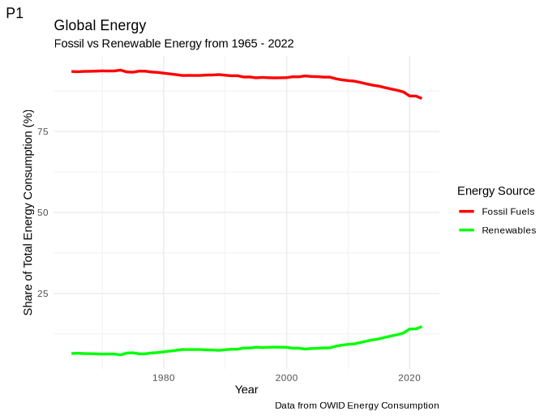
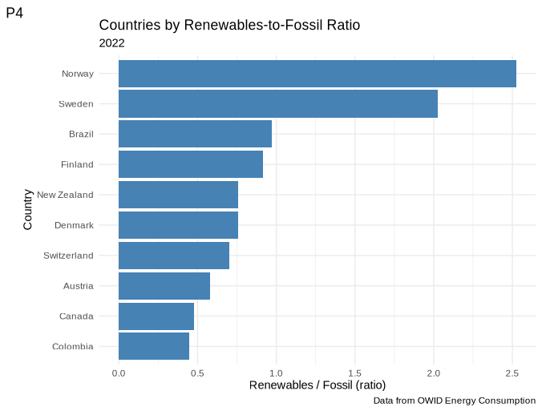
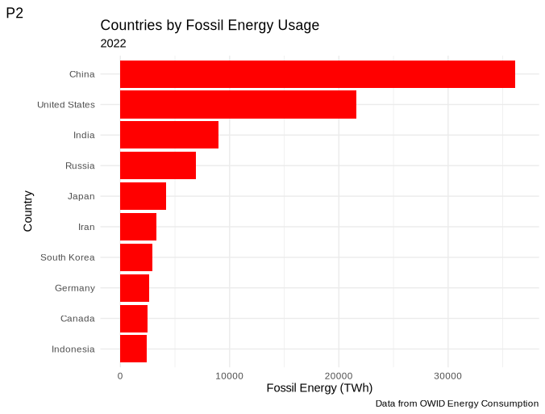
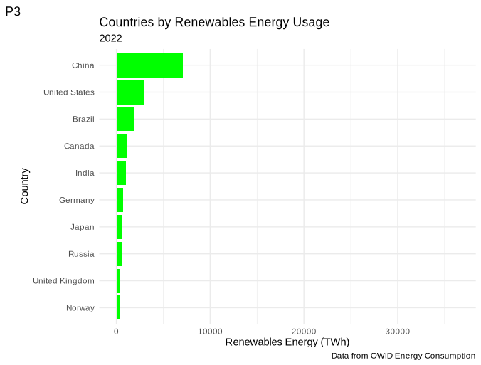

# OWID Energy Consumption Exploratory Analysis

**Multi-tool exploratory analysis of fossil vs renewable energy (1965–2022) using the OWID dataset.**

Exploratory analysis of global energy consumption using the [OWID dataset](https://www.kaggle.com/datasets/pralabhpoudel/world-energy-consumption), combining **Spreadsheets**, **SQL**, **Tableau**, and **R** to explore fossil vs renewable energy trends.

---

## 🔍 Project Objectives
- Explore global primary energy consumption from **1965 to 2022**  
- Compare **fossil fuel vs renewable** energy consumption across countries  
- Use multiple tools to highlight their strengths:
  - *Spreadsheets* for quick exploration and geospatial visualization
  - *SQL* for structured filtering and aggregation
  - *Tableau* for interactive dashboards
  - *R (tidyverse)* for reproducible analysis and advanced visualizations
- Identify countries that are most **efficient at adopting renewables** relative to fossil fuels

---

```
## 📂 Project Structure
data/
├─ World Energy Consumption.csv
├─ Fossil_vs_Renew.csv
└─ Fossil_vs_Renew_World.csv

r/
├─ World_Energy_Consumption_Exploration_Analysis.R
├─ Energy_Share.png
├─ Top_Fossil.png
├─ Top_Renewables.png
└─ Best_Efficiency.png

spreadsheet/
├─ World_Energy_Consumption_Processed.csv
├─ Energy Consumption Over Years.png
├─ Energy Consumption per Capita 2020.png
├─ Energy per Capita.png
└─ Primary Energy Consumption 2020.png

sql/
├─ Energy_Consumption_Percentage.sql
└─ Energy_Consumption_Percentage_World.sql

tableau/
└─ Tableau Example 2022.png
```

---

## Step 1: Spreadsheet Exploration
We begin with spreadsheets to quickly **plot trends and map geospatial data**.  
The dataset starts from **1965**, which is why our analysis uses this year as the baseline.  

### Example: Energy Consumption per Capita (1965–2022)
  

This shows global energy consumption per capita rising steadily, reflecting both population growth and increased industrialization. However, growth is uneven across regions.

---

## Step 2: SQL Analysis
SQL allows faster, more structured analysis.  
We created new columns (e.g., **fossil share** and **renewable share**) and applied filters.  
For example, keeping only valid ISO codes allowed Tableau to correctly generate maps.  

Key outputs:  
- `Energy_Consumption_Percentage.sql` → country-level energy share  
- `Energy_Consumption_Percentage_World.sql` → includes world totals  

---

## 📍 Step 3: Tableau Interactive Dashboards
Tableau was used for **interactive geospatial visualization**.  
Unlike spreadsheets, it allows users to dynamically explore energy trends year by year.  

👉 [View the Tableau Public Dashboard](https://public.tableau.com/views/EnergyOverYearOWIDEnergyConsumptionDataset/Sheet1?:language=en-US&:sid=&:redirect=auth&:display_count=n&:origin=viz_share_link)

### Example: 2022 Efficiency Map
  

This interactive view lets us adjust sliders to observe changes from **1965–2022**, giving richer insights into how renewables adoption spread globally.

---

## 📈 Step 4: R (tidyverse) Advanced Analysis
Finally, R provides **reproducibility** and advanced visualization.  
We used `dplyr` for transformations and `ggplot2` for visualizations.

### Plot 1: Fossil vs Renewable Share (1965–2022)
  
Fossil fuels still dominate, but renewables show steady growth since the 2000s.

### Plot 2: Top 10 Countries by Renewables-to-Fossil Ratio (2022)
  
Although China leads in absolute renewable use, this ratio highlights smaller countries that are **more efficient in transitioning**.

### Plot 3: Top Fossil vs Renewables Users
   
A side-by-side comparison showing that the **largest consumers of renewables are also major fossil users**, underlining the importance of efficiency metrics.

---

## ✅ Key Insights
- Fossil fuels remain dominant globally, but renewables are steadily growing.  
- China, USA, and India lead fossil fuel usage, but also top renewables in absolute terms.  
- Smaller countries (with higher renewables-to-fossil ratios) may serve as **better role models** for transition strategies.  

---

## ⚙️ Tools Used
- **Spreadsheets** → Initial exploration, quick trends, and static maps  
- **SQL** → Data transformation, filtering, and percentage calculations  
- **Tableau Public** → Interactive dashboards and geospatial insights  
- **R (tidyverse)** → Reproducible analysis, ratio metrics, and advanced plots  

---

## 📜 License
This project is licensed under the MIT License — see [LICENSE](LICENSE) for details.
