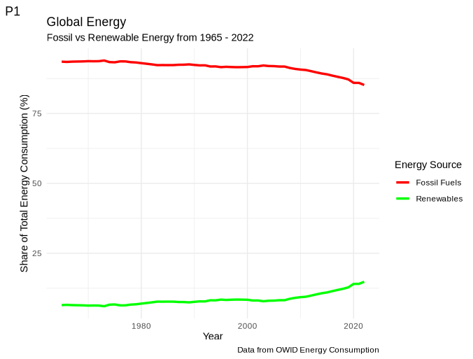
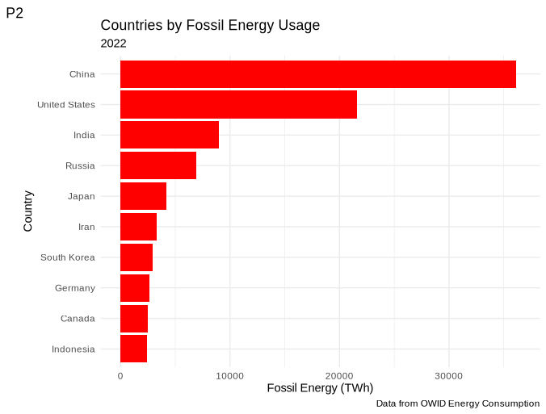
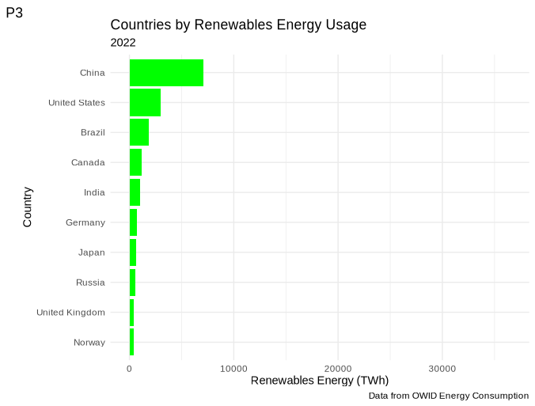
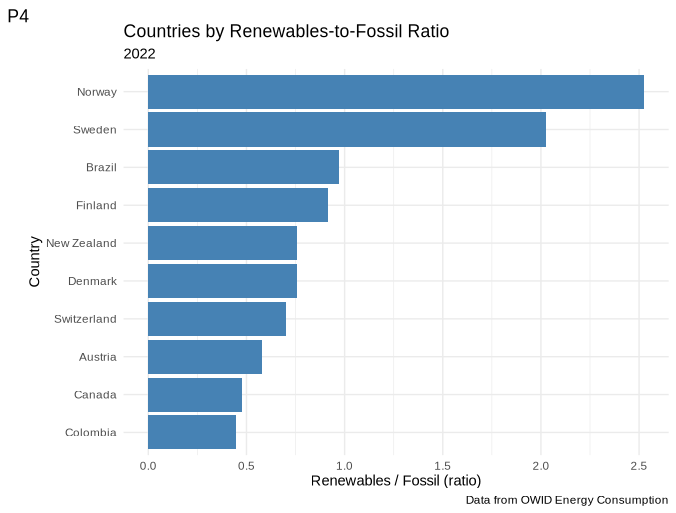

# OWID Energy Consumption Exploratory Analysis

**Exploring Global Energy Trends (1965–2022) with Fossil vs Renewable Energy**

Energy consumption is a driver of economic growth, but it also comes with environmental consequences. Understanding how we rely on fossil energy versus renewable energy is essential for planning a sustainable future. Using the [OWID Dataset](https://www.kaggle.com/datasets/pralabhpoudel/world-energy-consumption) downloaded from Kaggle, this project explores global energy trends from 1965 to 2022, highlighting which countries are adopting renewables efficiently and which remain heavily dependent on fossil fuels.

The analysis combines multiple tools:
- spreadsheets
- SQL
- Tableau Public
- R
- Python (Machine Learning)

Providing a thorough view of our energy consumption patterns and forecasting.

---

## Project Objectives

The goal of this project is to explore global primary energy consumption over the last six decades, comparing fossil fuel and renewable energy usage across countries. By leveraging multiple tools, we aim to:
- Identify trends in energy consumption over time
- Highlight countries leading in renewables adoption
- Compare absolute consumption versus efficiency in transitioning to green energy
- Forecast of fossil vs renewables in 2035
- Demonstrate the strengths of different tools for exploratory analysis, interactive visualization, and reproducible metrics

---

## Step 1: Spreadsheet Exploration
We began our exploration with spreadsheets to quickly visualize global energy consumption trends and create simple geospatial maps. The dataset starts from 1965, which provides a long-term perspective on energy use.

Plotting energy consumption per capita revealed a steady global increase, reflecting growing industrialization and rising energy needs. However, the growth of renewable energy is uneven across regions, which we will explore later in this project.

Spreadsheets also allowed us to generate static maps of energy consumption, offering an initial view of regional differences. This early step was crucial to form hypotheses that we later tested using SQL, Tableau, and R.

---

## Step 2: SQL Analysis
While spreadsheets are excellent for quick exploration, SQL provided a more structured way to filter data, calculate percentages, and prepare the dataset for advanced visualization. We created new columns such as fossil_pct and renew_pct to represent fossil and renewable energy percentages share.

Cleaning the dataset by keeping only valid ISO country codes, ensured that Tableau dashboards could accurately display geospatial patterns. SQL scripts included:
- `Energy_Consumption_Percentage.sql` → country-level energy share  
- `Energy_Consumption_Percentage_World.sql` → includes **world** row for global totals

By structuring the data in SQL, we laid the foundation not only for visualizing raw consumption but also for calculating efficiency metrics.

---

## Step 3: Tableau Interactive Dashboards
With a clean dataset, we turned to Tableau to create dynamic, interactive dashboards that reveal energy trends year by year. Unlike static spreadsheet plots, these dashboards allow users to explore changes across decades, uncovering patterns that might otherwise remain hidden.

[View the Tableau Public Dashboard](https://public.tableau.com/views/EnergyOverYearOWIDEnergyConsumptionDataset/Sheet1?:language=en-US&:sid=&:redirect=auth&:display_count=n&:origin=viz_share_link)

### Example: 2022 Efficiency Map
  

Interactive exploration in Tableau highlights countries that not only consume renewable energy but do so efficiently relative to their fossil fuel use. For instance, based on this [report](https://energy-information.canada.ca/en/energy-facts/clean-power-low-carbon-fuels) Canada generates a large portion of its electricity from renewables, but our dataset accounts for all energy consumption, which can make it appear lower on the map. This underscores the importance of understanding the scope of the data when interpreting visualizations.

---

## Step 4: R (tidyverse) Advanced Analysis
While Tableau provides an interactive view, we wanted reproducible and detailed analyses. For this, we leveraged R and the tidyverse library. Using dplyr, we transformed the data and calculated metrics like the renewables-to-fossil ratio, which measures how efficiently a country is transitioning toward greener energy. With ggplot2, we generated advanced visualizations for trends and comparisons.

### Plot 1: Fossil vs Renewable Share (1965–2022)
  
Fossil energy still dominates, but renewables show steady growth since the 2000s. We still need to make an effort to transition toward greener energy and reduce fossil fuel use. We can also visualize which country uses the most fossil energy and renewable energy such as the plot below.

### Plot 2 & 3: Fossil vs Renewables Users
   
A side-by-side comparison showing that the largest consumers of renewables are also major fossil users, underlining the importance of efficiency metrics. Here, China uses the most for both fossil and renewable energy. Absolute consumption tells one story, but efficiency metrics reveal another layer of insight.

### Plot 3: Top 10 Countries by Renewables-to-Fossil Ratio (2022)
  
Smaller countries with high ratios, such as Norway, demonstrate that efficient adoption of renewables is possible even without dominating absolute energy consumption. This metric highlights countries that can serve as role models for sustainable energy transitions.

---

## Step 4: Python Deep Learning Forecasting

While R is excellent for data wrangling and statistical graphics, Python lets us apply **deep-learning models** to extend the analysis into the future.  
Using `numpy`, `pandas`, `matplotlib`, `scikit-learn`, and `tensorflow/keras`, we built and trained two sequence models:

- **Recurrent Neural Network (RNN)**: a simpler model that processes sequences but has limited memory.  
- **Long Short-Term Memory (LSTM)**: an advanced RNN variant designed to capture longer-term temporal patterns.

The models were trained on the global [Fossil_vs_Renew_World.csv](data/Fossil_vs_Renew_World.csv) data (1965–2022) after scaling with `MinMaxScaler` from scikit-learn.  
We then forecasted energy shares **13 years ahead (to 2035)**.

- **RNN Forecast**  
    
  Three RNN layers with 32 neurons each reproduced historical trends reasonably well, but the forward forecast under-predicted renewable growth, this might be due to the limited 56-year training window.

- **LSTM Forecast**  
    
  A two-layer LSTM with 64 units captured the upward renewable trend more accurately.  
  It projects that by **2035** renewables could reach **≈ 37% of global primary energy** which is a great effort where a quarter of our total energy usage is using green energy. However, although LSTM is suitable for forecasting long into the future, the limited dataset is the bottleneck for this model.

Full training and plotting code is available in [`python/energy_forecast.py`](python/energy_forecast.py).

---

## Key Insights  

From this analysis, we observe that:

* Fossil fuels remain dominant globally, but renewables are steadily growing.  
* Large countries may lead in absolute renewable energy use, but smaller countries often achieve higher efficiency in transitioning.  
* Efficiency metrics like the renewables-to-fossil ratio help identify true leaders in sustainable energy adoption.  
* Machine-learning forecasts in Python (RNN & LSTM) reinforce the trend: even simple neural networks predict continued renewable growth and a gradual fossil-fuel decline through 2035.  
* Combining multiple tools: spreadsheets, SQL, Tableau, **R**, and **Python deep learning**; provides a complete workflow from exploration to interactive visualization to forward-looking prediction.

All data can be found here:
[Github](https://github.com/tammahasya/owid-energy-consumption-exploratory.git)

---

## Tools Used
- **Spreadsheets** → Initial exploration, quick trends, and static maps  
- **SQL** → Data transformation, filtering, and percentage calculations  
- **Tableau Public** → Interactive dashboards and geospatial insights  
- **R (tidyverse)** → Reproducible analysis, ratio metrics, and advanced plots
- **Python (Machine Learning)** → Forecasting the trend of fossil and renewables analysis into the future

---

## References & Acknowledgements
- Our World in Data - [Energy Dataset](https://ourworldindata.org/energy)
- Kaggle - [World Energy Consumption Dataset](https://www.kaggle.com/datasets/pralabhpoudel/world-energy-consumption)

Thanks to the teams behind OWID and Kaggle user, Pralabh Poudel, for making this data publicly available, which made this analysis possible.

---

## License
This project is licensed under the MIT License — see [LICENSE](LICENSE) for details.
